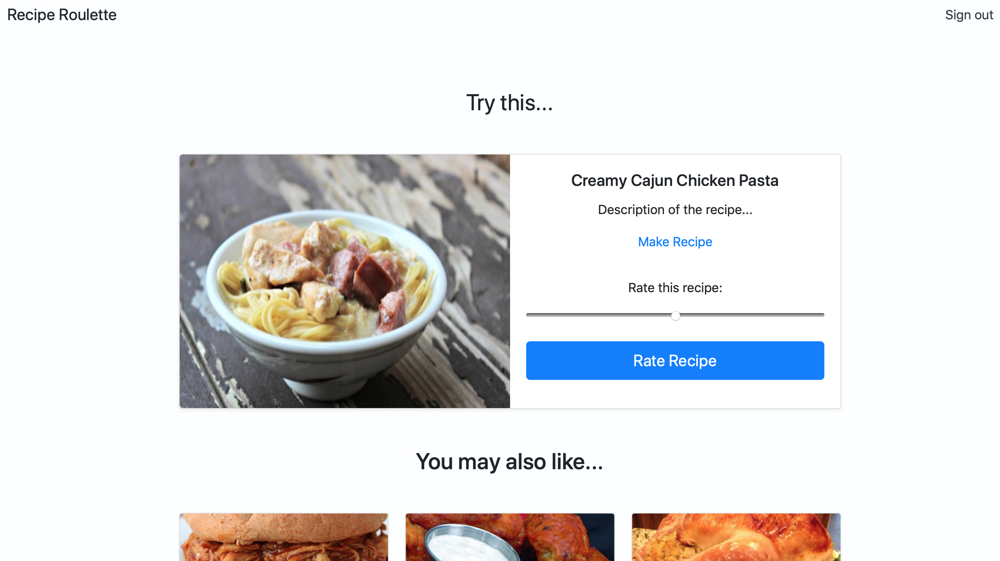

# Recipe Roulette

Recipe Roulette makes meal planning easier with machine learning and artificial intelligence.

## Project Status

This project is currently in development. Users can sign up, sign in, sign out, rate recipes, and receive recommendations based on their similarity to other users (collaborative filtering).

The long-term goal is to deploy a web application where users can view recommended recipes, save their own recipes, and rate recipes that they cook to fine-tune the recommendations. This may include the addition of item-based filtering or deep learning models using ingredient and taste vectors.

## Getting Started

Recipe Roulette is a Flask application tested against Python `>= 3.6`.

To install Recipe Roulette, clone this repo and run:

`pip install -e .`

After you install the package, initialize and seed the database:

`flask init-db`

The script will automatically import ~20 recipes from AllRecipes.com.

## Use

Users can sign up and rate recipes based on the title, image, and link.

As ratings accumulate, recommendations will begin to appear under the recipe to rate.

## Configuration

You can configure multiple forms of machine learning by passing a different argument into the `getRecommendations` function in the `rating.py` blueprint.

The current options are:
* Euclidean Distance: `similarity=sim_distance`
* Pearson Coefficient: `similarity=sim_pearson`

## Interested?

If you're interested in this line of work, please contact me or even submit a pull request to this project.

Recipe Roulette is licensed under the MIT License.
